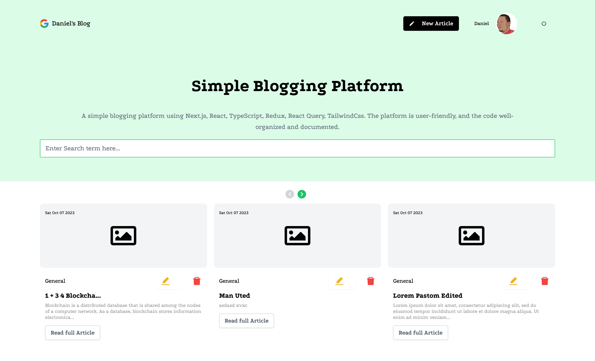

# Simple Blogging Platform

This is the offical documentation for a simple blogging platform project built using Next.js, React, TypeScript, and other technologies. The project aims to create a user-friendly website where users can create, read, update, and delete blog posts, as well as search for posts by title.



## URL

## Built with

- ⚡️ Next.js 13
- ⚛️ React 18
- ✨ TypeScript
- 💨 Tailwind CSS 3
- ✨ Firebase
- ✨ Redux
- ✨ React Query
- ✨ React-Quill textEditor
- 🃏 Jest — Configured for unit testing

## Features

This project implements the following features:

- 💎 CRUD Functionality for Blog Posts: Users/Authors can create, read, update, and delete blog posts. Each post has a title, content, and a created/updated timestamp. A simple text editor is used for creating and editing posts. Only an author can perform CRUD operations except for the R- Read operation which is permissible for every User.
- 💎 Users can Onoboard the Application using Google Social Authentication as facilitated by Firebase.
- 💎 List and Single Post View: The homepage lists all blog posts with pagination. A single post view page displays the full content of a post
- 💎 Search Functionality: Users can search for posts by title using a search bar.
- 💎 API Integration: React Query is used for data fetching, caching, and state management. Firebase Firestore is used as a backend service for data storage and retrieval.
- 💎 State Management: React Redux is used as a state management library to manage the application’s state (e.g., current user, current post, etc.).
- 💎 Basic Styling: Tailwind CSS is used as a UI framework to style the components. The UI is clean and responsive.

// Todo

- 💎Bonus Features: Comments functionality where users can comment on posts. Emotion is used as a CSS-in-JS library.

## Getting Started

To run this project locally, you will need to have Node.js, npm, and TypeScript installed on your machine. You will also need to create a Firebase account and a project with Firestore database enabled. You can follow the instructions [here](https://firebase.google.com/docs/web/setup) to set up Firebase for your project.

## Installation

Clone this repository to your local machine:

```
git clone https://github.com/todak2000/micro-blog.git

```

Navigate to the project directory and install the dependencies:

```
cd micro-blog
yarn install
```

Create a `.env` file in the root directory and add your Firebase configuration variables or refer to `.env.example` file for reference and guidance:

```
NEXT_PUBLIC_APIKEY=<your-api-key>
NEXT_PUBLIC_AUTHDOMAIN=<your-auth-domain>
NEXT_PUBLIC_PROJECTID=<your-project-id>
NEXT_PUBLIC_STORAGEBUCKET=<your-storage-bucket>
NEXT_PUBLIC_MESSAGINGSENDERID=<your-messaging-sender-id>
NEXT_PUBLIC_APPID=<your-app-id>
NEXT_PUBLIC_MEASUREMENTID=<your-measurement-id>

```

## Development

To start the development server, run the following command:

```
npm run dev
```

The website will be available at http://localhost:3000.

## API documentation

Refer to the API documentation

`src/pages/api/README.md` - [HERE](src/pages/api/README.md)

## Deployment

To deploy the website to a service like Vercel or Netlify, you will need to connect your GitHub repository to your hosting account and configure the environment variables.

## License

This project is licensed under the MIT License - see the LICENSE file for details.

## Author

[Daniel Olagunju](https://github.com/todak2000)
